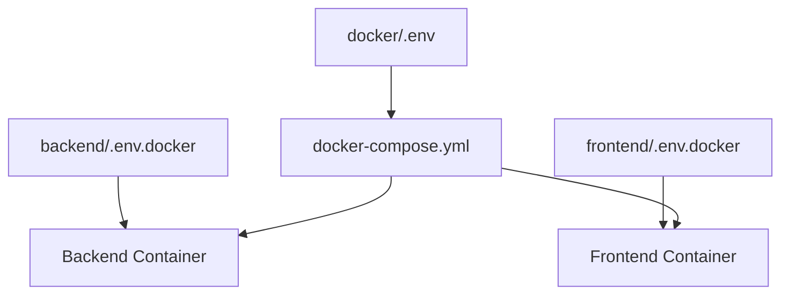

# Environment Variable Guide

This document describes the environment variable layout and best practices for the project.

## 📁 File Layout

```
toyagent
├── .gitignore                      # Root gitignore
├── backend/
│   ├── .env.example                # Local dev template
│   ├── .env                        # Local dev config (gitignored)
│   └── .gitignore                  # Backend gitignore
├── frontend/
│   ├── .env.local.example                # Local dev template
│   ├── .env.local                        # Local dev config (gitignored)
│   └── .gitignore                  # Frontend gitignore
└── docker/
    ├── .env.example                # Docker orchestration template
    ├── .env                        # Docker orchestration config (gitignored)
    └── docker-compose.yml          # Docker Compose config
```

---

## 🎯 Responsibilities

### 1. `docker/.env` - Docker orchestration layer

**Purpose**: infrastructure and orchestration settings

| Variable | Description | Default | Required |
|--------|------|--------|------|
| **Port mapping** | | | |
| `BACKEND_PORT` | Backend host port | `8000` | ✅ |
| `FRONTEND_PORT` | Frontend host port | `3000` | ✅ |
| `POSTGRES_PORT` | PostgreSQL host port | `5432` | ✅ |
| `TEMPORAL_PORT` | Temporal host port | `7233` | ✅ |
| **PostgreSQL** | | | |
| `POSTGRES_HOST` | PostgreSQL service name (Docker network) | `postgresql` | ✅ |
| `POSTGRES_USER` | PostgreSQL user (shared) | `postgres` | ✅ |
| `POSTGRES_PASSWORD` | PostgreSQL password | - | ✅ |
| `POSTGRES_DB` | Backend DB name | `i5agents` | ✅ |
| `POSTGRES_TEMPORAL_DB` | Temporal DB name | `temporal` | ✅ |
| **Temporal service** | | | |
| `TEMPORAL_HOST` | Temporal service name (Docker network) | `temporal` | ✅ |
| `TEMPORAL_NAMESPACE` | Temporal namespace | `default` | ✅ |

---

### 2. `backend/.env.docker` - Backend Docker runtime config

**Purpose**: backend application settings in Docker

| Variable | Description | Default | Required |
|--------|------|--------|------|
| **App settings** | | | |
| `APP_NAME` | App name | `i5-agents-backend` | ✅ |
| `APP_VERSION` | App version | `0.1.0` | ✅ |
| `APP_ENV` | Environment | `production` | ✅ |
| `DEBUG` | Debug mode | `false` | ✅ |
| **Server** | | | |
| `HOST` | Listen address (in container) | `0.0.0.0` | ✅ |
| `PORT` | Listen port (in container) | `8000` | ✅ |
| `RELOAD` | Hot reload | `false` | ✅ |
| **LLM API** | | | |
| `OPENAI_API_KEY` | OpenAI API Key | - | ✅ |
| `OPENAI_API_BASE` | OpenAI API Base URL | `https://api.openai.com/v1` | ✅ |
| `OPENAI_MODEL` | OpenAI model | `gpt-4` | ✅ |
| `ANTHROPIC_API_KEY` | Anthropic API Key | - | ❌ |
| `GOOGLE_API_KEY` | Google API Key | - | ❌ |
| `AZURE_OPENAI_ENDPOINT` | Azure OpenAI endpoint | - | ❌ |
| `AZURE_OPENAI_API_KEY` | Azure OpenAI API Key | - | ❌ |
| **CORS** | | | |
| `CORS_ORIGINS` | Allowed origins (comma-separated) | `http://localhost:3000,http://frontend:3000` | ✅ |
| `CORS_ALLOW_CREDENTIALS` | Allow credentials | `true` | ✅ |
| **Agent** | | | |
| `AGENT_TIMEOUT` | Agent timeout (seconds) | `300` | ✅ |
| `AGENT_MAX_ITERATIONS` | Agent max iterations | `10` | ✅ |

**Note**: These come from `docker-compose.yml` via `environment` and should **not** be defined here:
- `POSTGRES_HOST`, `POSTGRES_PORT`, `POSTGRES_USER`, `POSTGRES_PASSWORD`, `POSTGRES_DB`
- `TEMPORAL_HOST`, `TEMPORAL_PORT`, `TEMPORAL_NAMESPACE`

---

### 3. `frontend/.env.docker` - Frontend Docker runtime config

**Purpose**: frontend application settings in Docker

| Variable | Description | Default | Required |
|--------|------|--------|------|
| **Environment** | | | |
| `NODE_ENV` | Node environment | `production` | ✅ |
| **Auth** | | | |
| `NEXTAUTH_SECRET` | NextAuth secret | - | ✅ |
| **i18n** | | | |
| `NEXT_PUBLIC_DEFAULT_LOCALE` | Default locale | `en` | ✅ |
| `NEXT_PUBLIC_SUPPORTED_LOCALES` | Supported locales (comma-separated) | `en,zh,de` | ✅ |

**Note**: These are injected by `docker-compose.yml` and should **not** be set here:
- `NEXT_PUBLIC_API_URL` - hardcoded to `http://backend:8000`
- `NEXT_PUBLIC_WS_URL` - hardcoded to `ws://backend:8000/ws`
- `NEXT_PUBLIC_API_TIMEOUT` - from `docker/.env`
- `NEXTAUTH_URL` - generated as `http://localhost:${FRONTEND_PORT}`

---

### 4. `backend/.env` - Backend local development

**Purpose**: local dev config (similar to `.env.docker` but for localhost)

Key differences:
- `POSTGRES_HOST=localhost`
- `TEMPORAL_HOST=localhost`
- `DEBUG=true`
- `RELOAD=true`
- `CORS_ORIGINS=http://localhost:3000`

---

### 5. `frontend/.env` - Frontend local development

**Purpose**: local dev config

Key differences:
- `NODE_ENV=development`
- `NEXT_PUBLIC_API_URL=http://localhost:8000`
- `NEXT_PUBLIC_WS_URL=ws://localhost:8000/ws`

---

## 🔄 Load Order (Docker)



Priority (high → low):
1. `environment` in `docker-compose.yml`
2. `env_file` (e.g., `.env.docker`)
3. `ENV` in Dockerfile
4. Shell environment variables

Example:

```yaml
backend:
  env_file:
    - ../backend/.env.docker        # Load app config
  environment:
    - POSTGRES_HOST=${POSTGRES_HOST}  # Inject from docker/.env, overrides .env.docker
```

---

## 📋 Initialization Steps

### 1. Copy templates

```bash
# Backend
cp backend/.env.example backend/.env
cp backend/.env.docker.example backend/.env.docker

# Frontend
cp frontend/.env.example frontend/.env
cp frontend/.env.docker.example frontend/.env.docker

# Docker
cp docker/.env.example docker/.env
```

### 2. Generate secrets

```bash
# PostgreSQL password (shared by app and Temporal)
openssl rand -base64 32

# NextAuth Secret
openssl rand -base64 32
```

### 3. Fill values

Edit these files with real values:

**`docker/.env`**:
```bash
POSTGRES_PASSWORD=<generated password>
```

**`backend/.env.docker`**:
```bash
OPENAI_API_KEY=sk-xxxxxxxxxxxxx
```

**`frontend/.env.docker`**:
```bash
NEXTAUTH_SECRET=<generated secret>
```

---

## 🚀 Run

### Local development

```bash
# Backend
cd backend
python -m uvicorn main:app --reload

# Frontend
cd frontend
npm run dev
```

### Docker deployment

```bash
cd docker
docker-compose up --build
```

---

## 🔒 Security Notes

1. **Never commit** `.env` files (except `.example` templates).  
2. **Strong passwords**: at least 32 chars; use `openssl rand -base64 32`.  
3. **API keys**:  
   - OpenAI: https://platform.openai.com/api-keys  
   - Anthropic: https://console.anthropic.com/  
4. **Production**: use a secrets manager (AWS Secrets Manager, HashiCorp Vault, etc.).  

---

## ❓ FAQ

### Q1: Why split `.env` and `.env.docker`?

**A**: Separation of concerns  
- `.env` - local dev (direct Python/Node)  
- `.env.docker` - Docker runtime (different networking and service discovery)  

### Q2: Why is `docker/.env` so small?

**A**: Infra only  
- Orchestration handles ports, DB connections, service names  
- App settings live in each service’s `.env.docker`  
- Avoids duplicated configs  

### Q3: How is the Temporal DB created?

**A**: Temporal `auto-setup` image handles it  
- Uses `temporalio/auto-setup` image  
- Automatically creates `temporal` and `temporal_visibility` DBs  
- Uses the same PostgreSQL user (`postgres`)  
- No extra init scripts required  

### Q4: What if host ports conflict?

**A**: Change mappings in `docker/.env`

```bash
# If 5432 is taken
POSTGRES_PORT=5433

# Container still uses 5432; host exposes 5433
```

---

## 📚 References

- [Docker Compose Environment Variables](https://docs.docker.com/compose/environment-variables/)  
- [Next.js Environment Variables](https://nextjs.org/docs/basic-features/environment-variables)  
- [Temporal Configuration](https://docs.temporal.io/self-hosted-guide/setup)  
